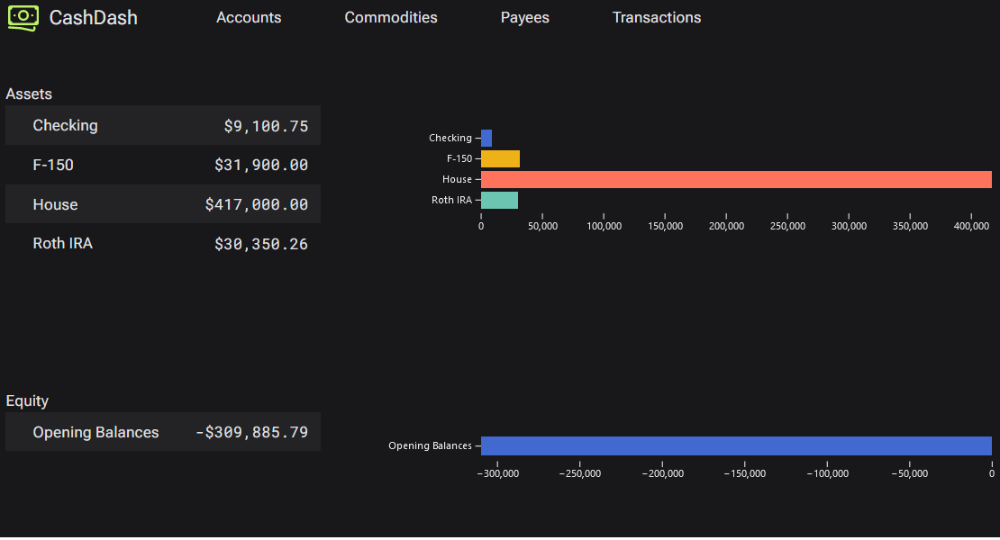
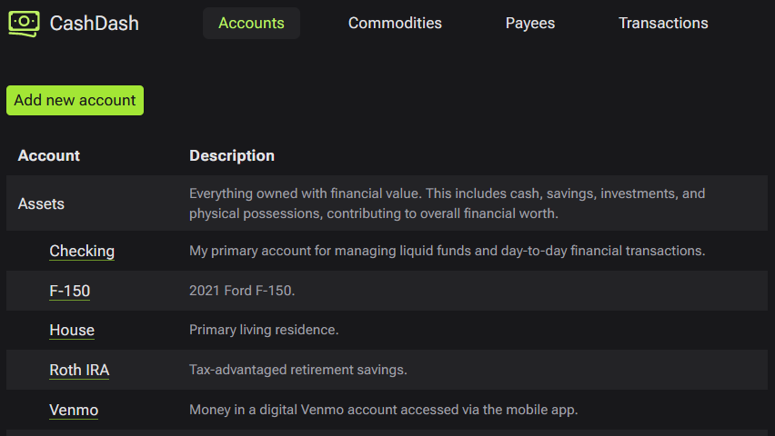
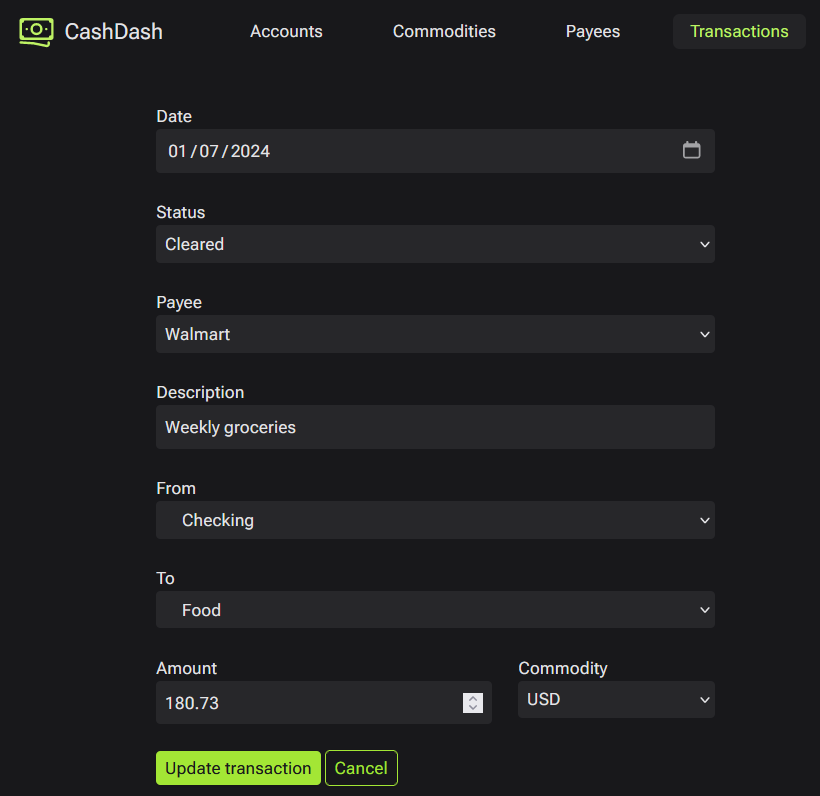

# CashDash

A personal finance bookkeeping tool.







## Installation

You must have [git](https://git-scm.com/) and [Node.js](https://nodejs.org)
installed.

Open up a terminal and clone this repository.

```sh
git clone https://github.com/travishorn/cashdash
```

Change into the newly created directory.

```sh
cd cashdash
```

Install the dependencies.

```sh
npm install
```

By default, commands will be run in development mode. You'll probably want to
switch to production first.

```sh
# On Linux
export NODE_ENV=production

# On Windows (PowerShell)
$env:NODE_ENV = "production"
```

Migrate the database. This creates the database structure.

```sh
npm run migrate
```

Seed the database. This inserts the necessary built-in data into the database.

```sh
npm run seed
```

**Warning:** this also resets the database. If you have entered any data
previously, it will be deleted when you run that command.

## Usage

Start the web server.

```sh
npm run dev
```

Now go to http://localhost:5173 to see the web UI.

## Data Entry

You can add, edit, and delete accounts, commodities, payees, and transactions
using the navigation links at the top of the page.

### Accounts

All transactions must have a "from" account and a "to" account to describe the
movement of commodities. You must define any account you want to use first.
These can be real accounts held with financial institutions or virtual accounts
you use to categorize expenses, income, and more.

Every account must have a **Parent account**.

There are five built-in top-level accounts included by default. They include:

- **Assets**: Everything owned with financial value. This includes cash,
  savings, investments, and physical possessions, contributing to overall
  financial worth.
- **Equity**: The residual value in the financial ledger, capturing the
  difference between assets and liabilities.
- **Expenses**: The costs incurred in daily life, such as bills, groceries, and
  other necessary outlays.
- **Income**: The money earned from various sources, like work, investments, or
  side hustles.
- **Liabilities**: Financial obligations and debts. This includes loans, credit
  card balances, and any amounts owed.

A built-in non-top-level account **Opening Balances** is included by default
with **Equity** as its parent to facilitate starting the ledger.

**Name** should be a very short identifier for this account. Account names must
be unique across the entire ledger.

**Description** should be a good description to remind you what the account is
and what it is used for.

### Commodities

Before you can enter any transactions, you will need to define any commodities
you will be using. The United States dollar (USD) is included by default.

**Name** is the name of the commodity. This is a very short (five characters or
less) identifier for the commodity. Ideally, use the [ISO 4217
code](https://en.wikipedia.org/wiki/ISO_4217) for the currency if one exists.

**Decimal factor** describes an integer by which to divide the lowest
denomination in order to get to the standard denomination. For example: the
lowest denomination for USD is cents (pennies). The **decimal factor** is `100`
for USD because you divide cents by 100 to get the standard denomination (the
dollar).

**Description** describes the commodity if you need to remember what it
represents.

### Payees

Every transaction needs an associated payee. This could be the entity paying or
being paid.

**Name** is a very short unique identifier for the payee. For example, **Allied
Universal** could be a payee for your employer who will transfer money to you as
a salary. **Walmart** could be a payee who you transfer money to when you
purchase groceries.

**Description** should be a good description to remind you what the payee is.

A built-in **Opening Balances** payee is included by default to facilitate
starting the ledger.

### Transactions

Every time money moves from one account to another (even if it's to a virtual
"expense" account like **Groceries**), record it as a transaction.

**Date** is the date the transaction occurred.

**Status** must be either...

- **Cleared**: Transaction has been successfully processed, and funds are
  securely transferred. The financial operation is complete, and the transaction
  is considered finalized.
- **Pending**: Transaction is in progress or awaiting further processing. Funds
  may not have been transferred yet, and additional steps may be required before
  the transaction is considered complete.

**Payee** is the entity being payed or paying.

**Description** is a good description of the transaction so you can remember why
it occurred or what it involved later.

**From** indicates which account is being debited (money is coming from).

**To** indicates which account is being credited (money is going to).

**Amount** is the amount of the commodity that was transferred, in terms of the
lowest denomination (for example, cents for USD).

**Commodity** indicates the commodity being transferred.

## Reports

You can get a list of every account, commodity, payee, and transaction by using
the navigation links at the top.

The homepage shows current account balances as tables and charts.

Many interactive tables and charts are planned but do not exist at the moment.

Those with the skill may also generate reports by interacting with the SQLite
database directly, which is generated in the root project directory as
`development.sqlite3` or `production.sqlite3` depending on which environment you
started the server in.

## To Do

- Error-handling of forms
- Confirmation/undo form actions
- Many more reporting views with interactive elements
- Import from CSV system

## License

The MIT License

Copyright 2024 Travis Horn

Permission is hereby granted, free of charge, to any person obtaining a copy of
this software and associated documentation files (the “Software”), to deal in
the Software without restriction, including without limitation the rights to
use, copy, modify, merge, publish, distribute, sublicense, and/or sell copies of
the Software, and to permit persons to whom the Software is furnished to do so,
subject to the following conditions:

The above copyright notice and this permission notice shall be included in all
copies or substantial portions of the Software.

THE SOFTWARE IS PROVIDED “AS IS”, WITHOUT WARRANTY OF ANY KIND, EXPRESS OR
IMPLIED, INCLUDING BUT NOT LIMITED TO THE WARRANTIES OF MERCHANTABILITY, FITNESS
FOR A PARTICULAR PURPOSE AND NONINFRINGEMENT. IN NO EVENT SHALL THE AUTHORS OR
COPYRIGHT HOLDERS BE LIABLE FOR ANY CLAIM, DAMAGES OR OTHER LIABILITY, WHETHER
IN AN ACTION OF CONTRACT, TORT OR OTHERWISE, ARISING FROM, OUT OF OR IN
CONNECTION WITH THE SOFTWARE OR THE USE OR OTHER DEALINGS IN THE SOFTWARE.
